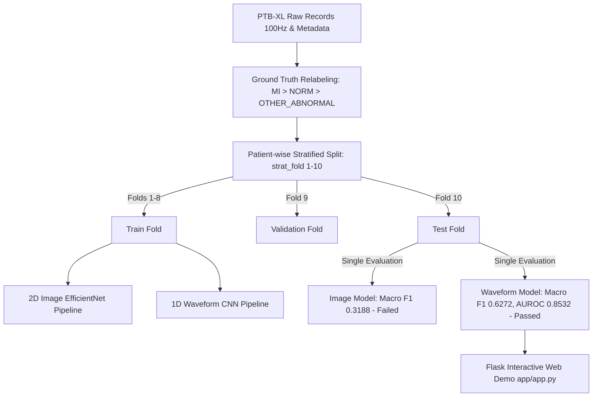

# CardioScan: ECG Classification on PTB-XL (Image vs Waveform Models)

[](https://www.python.org/)
[](https://www.tensorflow.org/)
[](LICENSE)

CardioScan is an educational research project evaluating deep learning approaches for 12-lead Electrocardiogram (ECG) classification on the publicly available **PTB-XL dataset**. 

> [!IMPORTANT]
> **Clinical Disclaimer**: Educational and research purposes only. Not a certified medical device.

---

## 📌 Overview & Key Findings

This project systematically diagnoses and compares two primary modeling approaches for ECG classification under a strict **patient-wise leak-free split**:

1. **2D Image Model (EfficientNetB0)**: Trained on visual plots of scanned 12-lead ECGs. Under a leak-free patient split, the 2D image model collapsed to near-random prediction (**Macro F1: 0.3188**, **Macro AUROC: 0.5103**), failing to beat the random baseline (**Macro F1: 0.3359**). Visual grid features in 2D plots do not generalize across distinct patient recordings. Note: The legacy `model/best_efficientnet.h5` was trained with a leaky split and is not trusted.
2. **1D Waveform Model (1D CNN)**: Trained on raw 100 Hz 12-lead digital ECG signals loaded via `wfdb`. The 1D CNN achieved strong, statistically significant performance (**Macro F1: 0.6272**, **Macro AUROC: 0.8532**), with a bootstrap 95% confidence interval strictly above all baselines.

---

## 📊 Summary Results Table

Evaluated on the leak-free test split (**PTB-XL Stratified Fold 10**):

| Model / Strategy | Test Samples (N) | Test Accuracy (95% CI) | Macro F1 (95% CI) | Macro AUROC (95% CI) | Status |
| :--- | :---: | :---: | :---: | :---: | :---: |
| **Majority Baseline ("Always Predict NORM")** | 239 | 0.5565 [0.4937, 0.6192] | 0.2384 [0.2204, 0.2547] | 0.5000 [0.5000, 0.5000] | Baseline |
| **Random Class Frequency Baseline** | 239 | 0.4100 [0.3515, 0.4728] | 0.3359 [0.2801, 0.3900] | 0.5000 [0.4350, 0.5650] | Baseline |
| **2D Image Model (EfficientNetB0)** | 239 | 0.3598 [0.3013, 0.4226] | 0.3188 [0.2578, 0.3770] | 0.5103 [0.4412, 0.5794] | Failed (Does not beat baseline) |
| **1D Waveform Model (1D CNN)** | 156 | **0.7051** [0.6282, 0.7756] | **0.6272** [0.5379, 0.7060] | **0.8532** [0.8028, 0.9002] | **PASSED (Beats baseline; CI no overlap)** |

---

## 🏗️ Architecture & Pipeline Diagram



---

## 🛠️ Tech Stack

- **Core & Logic**: Python 3.11, NumPy, Pandas, Scikit-learn
- **Deep Learning**: TensorFlow 2.21, Keras
- **ECG Signal Processing**: WFDB (`wfdb`), Matplotlib
- **Web Application**: Flask, HTML5, CSS3, JavaScript (Vanilla)

---

## 📂 Repository Structure

```
CardioScan/
├── app/
│   ├── app.py                  # Flask web application demo (sample picker & waveform 1D model)
│   └── samples/                # Included PTB-XL sample records (.npy signals & metadata)
├── docs/                       # Screenshots and user flow documentation
├── model/
│   ├── best_efficientnet_leakfree.h5  # Evaluated 2D image model (leak-free split)
│   └── waveform_1d_cnn.h5             # Trained 1D waveform CNN model
├── results/
│   ├── diagnosis.md            # Part 1 image model collapse diagnostic report
│   ├── metrics_summary.md      # Consolidated model evaluation & baseline comparison
│   ├── metrics_waveform.json   # 1D CNN evaluation JSON output
│   └── confusion_matrix_part1.png
├── src/
│   ├── download_ptbxl_100hz.py # Multi-threaded PhysioNet PTB-XL downloader
│   ├── run_part1_diagnosis.py  # Part 1 2D image model diagnostic runner
│   ├── train_waveform_all.py   # Part 2 1D waveform CNN training & evaluation script
│   ├── train_efficientnet.py   # Image model training script
│   └── evaluate_model.py       # Evaluation script
├── tests/
│   └── test_leak_free_split.py # Pytest unit tests for patient & image split integrity
├── splits/
│   └── split_leakfree.csv      # Patient-wise strat_fold split index
├── ptbxl_database.csv          # PTB-XL database metadata
├── scp_statements.csv          # SCP statement definitions
├── Dockerfile                  # Container definition
├── requirements.txt            # Python dependencies
└── README.md                   # Project documentation
```

---

## 🧪 Data & Leak-Free Split Methodology

### Ground Truth Relabeling
Labels are derived from official SCP statements (`scp_statements.csv`) with `likelihood >= 50.0`:
1. **MI**: If Myocardial Infarction (`MI`) superclass is present.
2. **NORM**: If Normal (`NORM`) is the sole diagnostic superclass.
3. **OTHER_ABNORMAL**: If any other superclass (`STTC`, `CD`, `HYP`) is present.
4. **Excluded**: Records without any usable diagnostic code with likelihood ≥ 50 are excluded (1,426 records).

> **Label Agreement**: Comparing legacy folder labels with PTB-XL ground truth revealed a **77.2% agreement rate** (22.8% discrepancy resolved).

### Patient-Wise Split
The dataset uses official PTB-XL `strat_fold` assignments:
- **Train**: Folds 1–8
- **Validation**: Fold 9
- **Test**: Fold 10

Unit tests (`tests/test_leak_free_split.py`) enforce zero overlap of `patient_id` or `ecg_id` across train, validation, and test splits.

---

## 🚀 Setup & Execution Guide

### 1. Installation
```bash
git clone -b merge-ecg https://github.com/SiddhiDeshmukh310/CardioScan.git
cd CardioScan
pip install -r requirements.txt
```

### 2. Run Split Integrity Tests
```bash
pytest tests/test_leak_free_split.py
```

### 3. Train & Evaluate 1D Waveform Model
```bash
python src/train_waveform_all.py
```

### 4. Launch Flask Web Application Demo
```bash
python app/app.py
```
Navigate to `http://127.0.0.1:5000` in your web browser.

---

## ⚠️ Limitations & Scope

- **Image Model Limitations**: 2D scanned ECG plot images contain visual grid and formatting variations that fail to generalize under leak-free patient splits.
- **Sample Scope**: The web demo features pre-packaged PTB-XL sample records for rapid demonstration without requiring local multi-gigabyte dataset downloads.
- **Screening Demo**: CardioScan is designed as an educational screening proof-of-concept.

---

## 📖 Citation & Credits

- Dataset provided by **PhysioNet**:
  > Wagner, P., Strodthoff, N., Bousseljot, R. D., Samek, W., & Schaeffter, T. (2020). *PTB-XL, a large publicly available electrocardiography dataset*. Scientific Data, 7(1), 154. 
  > PhysioNet Archive: [https://physionet.org/content/ptb-xl/1.0.3/](https://physionet.org/content/ptb-xl/1.0.3/)
