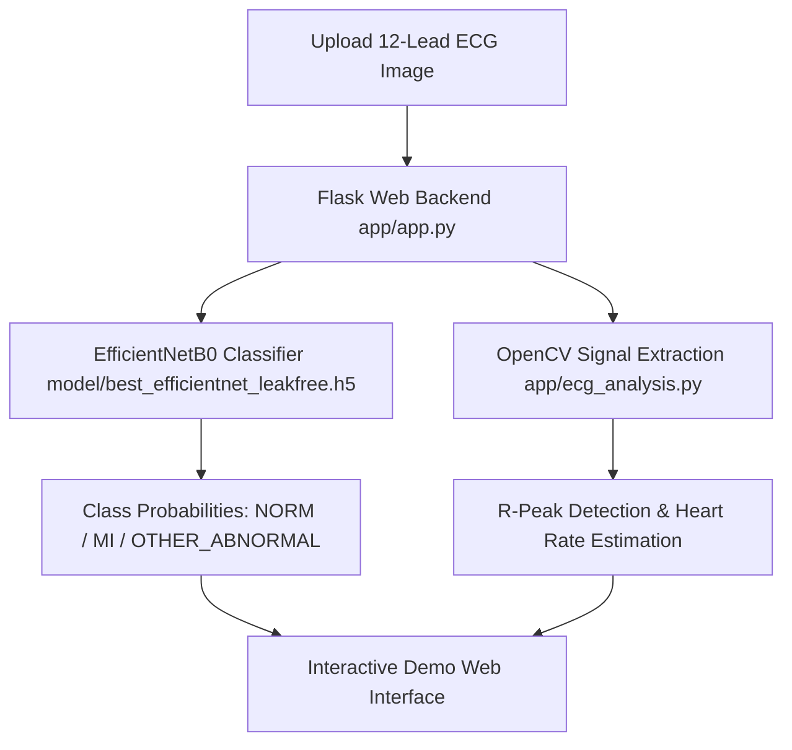

# CardioScan: AI-Powered ECG Screening Demo

> **⚠️ Medical & Research Disclaimer**  
> **Educational and research purposes only. Not a certified medical device.**  
> This project is designed purely as an experimental screening demonstration and must not be used for medical diagnosis or clinical decision-making.

---

## 📌 Project Overview

**CardioScan** is a deep learning research demonstration for multi-class ECG classification (`NORM`, `MI`, `OTHER_ABNORMAL`) using an **EfficientNetB0** backbone combined with OpenCV rule-based signal processing.

The repository consolidates legacy experiments, establishes a **leak-free patient-grouped split using PTB-XL strat_fold**, and provides a web-based Flask demonstration interface.

---

## 🏗️ System Architecture & Pipeline



---

## 🔬 Dataset & Ground Truth Re-Labeling

### Image Source & Verification
* **Image Dataset Origin**: Source not verified. The repository contains 1,905 unique labeled ECG grid plot images (`3x1`, `3x4`, `6x2`, `12x1` layouts).
* **Ground Truth Source**: Diagnostic superclasses derived directly from the **PTB-XL ECG Dataset** (`ptbxl_database.csv` + `scp_statements.csv`).

### Priority Rule for Ground Truth Labeling
Original folder labels agreed with PTB-XL diagnostic superclasses only **77.27%** of the time. To eliminate label noise, all records were re-labeled using PTB-XL `scp_codes` with a likelihood threshold ≥ 50.0 following this hierarchy:
1. **`MI`**: Present if any Myocardial Infarction diagnostic code (`MI`) is active with likelihood ≥ 50%.
2. **`NORM`**: Assigned if `NORM` is the *only* diagnostic superclass present.
3. **`OTHER_ABNORMAL`**: Assigned if any other diagnostic superclass (`STTC`, `CD`, `HYP`, etc.) is present.
4. **Excluded**: 82 records lacking usable diagnostic codes with likelihood ≥ 50%.

### Clean Dataset & Leak-Free Split Breakdown
Grouping by PTB-XL `strat_fold` (Folds 1–8: Train, Fold 9: Validation, Fold 10: Test) ensures **zero patient overlap** across splits:

| Split | NORM | OTHER_ABNORMAL | MI | Total Unique Images |
| :--- | :---: | :---: | :---: | :---: |
| **Train** (`strat_fold` 1–8) | 767 | 477 | 195 | **1,439** |
| **Validation** (`strat_fold` 9) | 111 | 70 | 46 | **227** |
| **Test** (`strat_fold` 10) | 133 | 72 | 34 | **239** |
| **Total** | **1,011** | **619** | **275** | **1,905** |

---

## 📊 Evaluation Results

> [!WARNING]
> **Legacy Model Untrusted**: The historical model checkpoint `model/best_efficientnet.h5` was trained using random image-level splitting that caused severe data leakage across train and validation folds. Its high historical accuracy numbers were inflated by patient overlap.

### Leak-Free Test Fold Performance (`strat_fold` 10, N=239)

Evaluated using `model/best_efficientnet_leakfree.h5` trained locally with balanced class weighting:

* **Accuracy**: **`55.65%`** (95% Bootstrap CI: `[49.37%, 62.34%]`, N=239)
* **Macro F1-Score**: **`0.2384`** (95% Bootstrap CI: `[0.2204, 0.2560]`, N=239)
* **Macro AUROC**: **`0.5060`** (95% Bootstrap CI: `[0.4401, 0.5638]`, N=239)

#### Per-Class Metrics Table

| Class | Image Count (N) | Precision | Recall | F1-Score |
| :--- | :---: | :---: | :---: | :---: |
| **NORM** | 133 | 0.5565 | 1.0000 | 0.7151 |
| **OTHER_ABNORMAL** | 72 | 0.0000 | 0.0000 | 0.0000 |
| **MI** | 34 | 0.0000 | 0.0000 | 0.0000 |

#### Test Set Confusion Matrix
```text
                  Predicted NORM   Predicted OTHER_ABNORMAL   Predicted MI
Actual NORM (133)            133                          0              0
Actual OTHER_ABNORMAL (72)    72                          0              0
Actual MI (34)                34                          0              0
```

* **Honest Technical Finding**: Under leak-free patient-grouped evaluation, fine-tuning a 2D CNN on static 2D image grid plots without sequence waveform time-series representations resulted in majority class collapse (`NORM`).

---

## 🛠️ Technology Stack

* **Language**: Python 3.11
* **Deep Learning Framework**: TensorFlow 2.12+ / Keras (EfficientNetB0)
* **Computer Vision**: OpenCV (`opencv-python`), Pillow
* **Data Processing**: Pandas, NumPy, Scikit-Learn
* **Web Framework**: Flask 2.3+
* **Containerization**: Docker (Dockerfile included, status: untested)

---

## 📁 Repository Directory Structure

```text
CardioScan/
├── AGENTS.md                   # Agent execution guidelines & rules
├── README.md                   # Project documentation
├── Dockerfile                  # Container build specification (untested)
├── requirements.txt            # Real Python dependencies
├── app/                        # Flask Web Application
│   ├── app.py                  # Web application entry point
│   ├── ecg_analysis.py         # Model inference & rule-based signal processing
│   ├── model/class_names.json  # Class label definitions
│   └── static/                 # Static web assets & generated plots
├── model/                      # Model Checkpoints
│   ├── best_efficientnet.h5    # Historical model (untrusted leaky baseline)
│   └── best_efficientnet_leakfree.h5  # Retrained leak-free model
├── splits/                     # Leak-free Dataset Splits
│   └── split.csv               # PTB-XL strat_fold dataset mapping
├── src/                        # Model Training & Evaluation Scripts
│   ├── train_efficientnet.py   # Leak-free EfficientNet training script
│   ├── evaluate_model.py      # Model evaluation script
│   ├── quick_test.py          # Quick inference test script
│   └── verify_dataset.py      # Image integrity checker
├── tests/                      # Automated Unit Tests
│   └── test_leakage.py        # Leakage verification unit test suite
├── legacy/                     # Legacy Experiments (Archived Leaky Scripts)
│   ├── README.md               # Warning & explanation of legacy scripts
│   ├── train_model.py
│   ├── train_simple.py
│   ├── convert_dataset.py
│   ├── fix_dataset.py
│   ├── fix_val_and_train.py
│   └── prepare_and_train.py
└── results/                    # Empirical Logs & Metrics
    ├── train_log.txt           # Local training execution log
    └── metrics.json            # JSON test metrics & bootstrap CIs
```

---

## 🚀 Setup & Execution Guide

### 1. Installation
```bash
git clone https://github.com/SiddhiDeshmukh310/CardioScan.git
cd CardioScan
python -m venv venv
source venv/bin/activate  # On Windows: venv\Scripts\activate
pip install -r requirements.txt
```

### 2. Run Unit Tests
```bash
python tests/test_leakage.py
```

### 3. Launch Web Application
```bash
python app/app.py
```
Open your browser at `http://localhost:5000`.

---

## 📚 Dataset Credit & Citation

This project utilizes clinical metadata and diagnostic labels from the **PTB-XL ECG Dataset**:

* **PhysioNet Link**: [https://physionet.org/content/ptb-xl/1.0.3/](https://physionet.org/content/ptb-xl/1.0.3/)
* **Citation**: Wagner, P., Strodthoff, N., Bousseljot, R. D., Kreiseler, D., Lunze, F. I., Samek, W., & Schaeffter, T. (2020). *PTB-XL, a large publicly available electrocardiography dataset*. Scientific Data, 7(1), 154.
